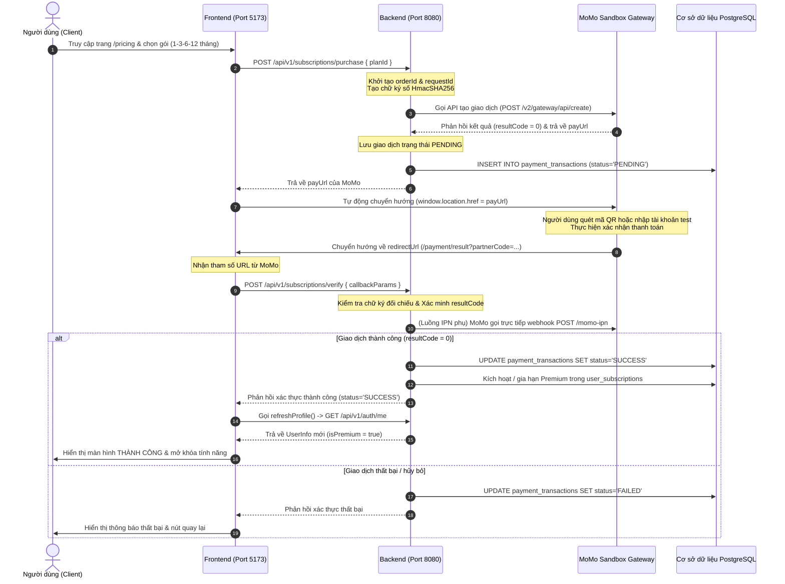

# Tài liệu Tích hợp Cổng Thanh toán MoMo Sandbox – PlanWise

Tài liệu này trình bày kiến trúc tích hợp cổng thanh toán điện tử MoMo Sandbox, cơ chế ký số bảo mật, luồng dữ liệu giữa Frontend - Backend - MoMo API và cách thức kiểm thử giả lập trên môi trường phát triển cục bộ (Localhost).

---

## 1. Quy trình giao dịch (Sequence Diagram)

Quy trình thanh toán từ lúc người dùng chọn gói cước đến khi kích hoạt tài khoản Premium thành công:



---

## 2. Cơ chế Ký số Bảo mật (HmacSHA256 Signature)

Để tránh các cuộc tấn công thay đổi thông tin giao dịch (như thay đổi số tiền `amount`, mã đơn hàng `orderId` hoặc trạng thái thanh toán), MoMo yêu cầu cả hai bên gửi/nhận dữ liệu đều phải thực hiện ký số bằng thuật toán **HmacSHA256** kết hợp với **Secret Key** do MoMo cấp.

### A. Chiều gửi (Tạo đường dẫn thanh toán)
Trước khi gửi yêu cầu tạo cổng thanh toán lên MoMo, Backend phải gộp các trường dữ liệu theo thứ tự bảng chữ cái và định dạng Query String:
```
accessKey=$accessKey&amount=$amount&extraData=$extraData&ipnUrl=$ipnUrl&orderId=$orderId&orderInfo=$orderInfo&partnerCode=$partnerCode&redirectUrl=$redirectUrl&requestId=$requestId&requestType=captureWallet
```
Sau đó, Backend dùng khóa bí mật `Secret Key` mã hóa chuỗi trên thành mã băm Hex:
$$\text{Signature} = \text{HmacSHA256}(\text{RawString}, \text{SecretKey})$$

### B. Chiều nhận (Xác thực callback phản hồi từ MoMo)
Khi nhận thông tin phản hồi từ client redirect hoặc IPN Webhook, Backend tiến hành gom các tham số nhận được:
```
accessKey=$accessKey&amount=$amount&extraData=$extraData&message=$message&orderId=$orderId&orderInfo=$orderInfo&partnerCode=$partnerCode&requestId=$requestId&resultCode=$resultCode&transId=$transId&responseTime=$responseTime
```
Và thực hiện tính toán chữ ký kỳ vọng. Nếu chữ ký tự tính toán trùng khớp với `signature` do MoMo gửi về, giao dịch được xác thực an toàn.

---

## 3. Chi tiết Cấu trúc Mã nguồn (Implementation Details)

Các thành phần cốt lõi được xây dựng trong mã nguồn:

### A. Lược đồ Cơ sở dữ liệu ([subscription_schema.sql](file:///d:/learning/EXE201/EXE201_PlanWise/database/subscription_schema.sql))
* **`subscription_plans`**: Lưu thông tin các gói dịch vụ (Tên, giá, thời hạn bằng tháng).
* **`user_subscriptions`**: Quản lý gói cước hiện hoạt của người dùng (`start_date`, `end_date`, `status` ACTIVE/EXPIRED).
* **`payment_transactions`**: Ghi vết lịch sử thanh toán (`order_id`, `request_id`, `amount`, `status` PENDING/SUCCESS/FAILED, `trans_id`).

### B. Lớp xử lý nghiệp vụ Backend
1. **[MomoPaymentService.java](file:///d:/learning/EXE201/EXE201_PlanWise/be/src/main/java/com/exe201/planwise/subscription/service/MomoPaymentService.java)**:
   * Chứa logic tính toán chữ ký số `signHmacSHA256()`.
   * Gửi yêu cầu qua `RestTemplate` tới MoMo Sandbox Endpoint (`https://test-payment.momo.vn/v2/gateway/api/create`).
   * Xác thực chữ ký phản hồi `validateMomoSignature()`.
   * Kích hoạt hoặc gia hạn tự động `activateUserSubscription()` cộng dồn ngày hết hạn nếu gói Premium cũ vẫn còn hiệu lực.
2. **[SubscriptionController.java](file:///d:/learning/EXE201/EXE201_PlanWise/be/src/main/java/com/exe201/planwise/subscription/controller/SubscriptionController.java)**:
   * Cung cấp API lấy gói cước `/plans`, khởi tạo giao dịch `/purchase`, xác thực callback `/verify`, và IPN Webhook `/momo-ipn`.

### C. Giao diện người dùng Frontend
1. **[PricingPage.tsx](file:///d:/learning/EXE201/EXE201_PlanWise/fe/src/app/components/PricingPage.tsx)**:
   * Hiển thị bảng so sánh quyền lợi giữa tài khoản Free và Premium.
   * Fetch các gói cước trực tiếp từ database của Backend và đưa ra các tùy chọn thanh toán.
2. **[PaymentResultPage.tsx](file:///d:/learning/EXE201/EXE201_PlanWise/fe/src/app/components/PaymentResultPage.tsx)**:
   * Bóc tách các tham số MoMo đính kèm ở URL.
   * Gửi gói dữ liệu lên Backend xác thực và hiển thị màn hình chúc mừng/thất bại tương ứng.

---

## 4. Giải pháp phát triển cục bộ (DEV Mock IPN)

> [!IMPORTANT]
> **Vấn đề kiểm thử localhost:**
> MoMo Server cần một public URL để gửi tín hiệu thanh toán thành công (IPN Webhook). Ở môi trường máy tính cá nhân (`localhost:8080`), MoMo Server không thể gọi trực tiếp webhook này nếu không sử dụng các dịch vụ tạo tunnel như `ngrok`.

### Giải pháp tích hợp DEV Mock:
Để thuận tiện và tăng tốc độ phát triển, hệ thống đã cài đặt cơ chế giả lập IPN:
1. **Endpoint giả lập ở Backend:**
   ```java
   @PostMapping("/mock-ipn")
   public ResponseEntity<Map<String, String>> mockIpn(@RequestParam String orderId) {
       momoPaymentService.mockIpnCallback(orderId);
       return ResponseEntity.ok(Map.of("status", "SUCCESS"));
   }
   ```
2. **Nút bấm kích hoạt ở Frontend:**
   * Trong trường hợp thanh toán trên MoMo Sandbox báo lỗi chữ ký số do sai cấu hình URL local, hoặc khi bạn nhấn Cancel để quay lại trang kết quả, màn hình kết quả sẽ nhận dạng môi trường phát triển cục bộ và hiển thị thêm panel **DEV ENVIRONMENT**.
   * Bấm vào nút **Giả lập Thanh toán Thành công (Mock IPN)** sẽ gọi trực tiếp endpoint Mock của Backend, kích hoạt tài khoản VIP lập tức và làm mới Context để người dùng trải nghiệm ngay các tính năng khóa Premium.
