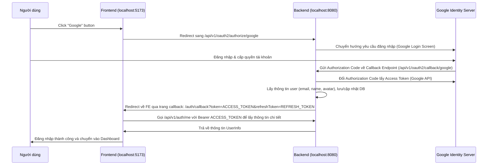

# Hướng dẫn Luồng Google OAuth2 & Cách Lấy Token - PlanWise

Tài liệu này hướng dẫn chi tiết cách thức hoạt động của tính năng đăng nhập Google OAuth2 trong ứng dụng PlanWise, các bước cấu hình cần thiết ở cả Backend & Frontend, và cách thức nhận, sử dụng JWT tokens.

---

## 1. Tổng quan Luồng OAuth2 (OAuth2 Flow)

Luồng đăng nhập Google OAuth2 trong ứng dụng PlanWise diễn ra như sau:



---

## 2. Cấu hình Backend (Spring Boot)

Để tính năng Google Login hoạt động, bạn cần cấu hình ứng dụng trên **Google Cloud Console** (lấy Client ID và Client Secret) và khai báo trong file cấu hình Backend.

### Bước 2.1: Lấy Client ID & Client Secret trên Google Cloud Console
1. Truy cập [Google Cloud Console](https://console.cloud.google.com/).
2. Tạo dự án mới hoặc chọn dự án hiện tại.
3. Vào **APIs & Services** > **OAuth consent screen**:
   - Cấu hình Consent Screen (User Type: External).
   - Điền các thông tin bắt buộc và cấu hình scopes: `email`, `profile`, `openid`.
4. Vào **APIs & Services** > **Credentials**:
   - Nhấp vào **Create Credentials** > **OAuth client ID**.
   - Chọn Application type: **Web application**.
   - Thêm **Authorized JavaScript origins**:
     - `http://localhost:5173` (Dành cho môi trường dev của React/Vite)
     - `http://localhost:3000`
   - Thêm **Authorized redirect URIs** (Đây là callback của Backend xử lý sau khi Google xác thực thành công):
     - `http://localhost:8080/api/v1/oauth2/callback/google`
5. Lưu lại để nhận **Client ID** và **Client Secret**.

### Bước 2.2: Cấu hình file `application.yaml` / `.env`
Bổ sung Client ID và Client Secret vào môi trường chạy backend (hoặc điền trực tiếp trong [application.yaml](file:///d:/learning/EXE201/EXE201_PlanWise/be/src/main/resources/application.yaml)):

```yaml
spring:
  security:
    oauth2:
      client:
        registration:
          google:
            client-id: <YOUR_GOOGLE_CLIENT_ID>
            client-secret: <YOUR_GOOGLE_CLIENT_SECRET>
```

Đồng thời cấu hình liên kết chuyển hướng trả về Frontend sau khi xác thực thành công:
```yaml
app:
  oauth2:
    authorized-redirect-uris:
      - http://localhost:5173/auth/callback  # Địa chỉ trang Callback của FE
```

---

## 3. Cách kích hoạt & Lấy Token từ Frontend

### Bước 3.1: Kích hoạt luồng đăng nhập
Từ giao diện đăng nhập Frontend (hoặc trình duyệt), chuyển hướng người dùng đến URL sau để bắt đầu tiến trình đăng nhập của Spring Security:
```
http://localhost:8080/api/v1/oauth2/authorize/google
```

*Ví dụ code React:*
```typescript
const handleGoogleLogin = () => {
  window.location.href = "http://localhost:8080/api/v1/oauth2/authorize/google";
};
```

### Bước 3.2: Nhận Token tại trang Callback
Sau khi người dùng đồng ý đăng nhập ở phía Google, Backend sẽ tự động xử lý và redirect trình duyệt quay về:
```
http://localhost:5173/auth/callback?token=<ACCESS_TOKEN>&refreshToken=<REFRESH_TOKEN>
```

Tại component xử lý trang `/auth/callback` (đã được tạo ở [AuthCallback.tsx](file:///d:/learning/EXE201/EXE201_PlanWise/fe/src/app/components/AuthCallback.tsx)), chúng ta trích xuất tokens từ URL:

```typescript
// Trích xuất query params từ URL
const [searchParams] = useSearchParams();
const token = searchParams.get("token");
const refreshToken = searchParams.get("refreshToken");

if (token && refreshToken) {
  // Lưu vào localStorage để sử dụng cho các request sau
  localStorage.setItem("accessToken", token);
  localStorage.setItem("refreshToken", refreshToken);
  
  // Tải thông tin người dùng từ Backend qua endpoint /api/v1/auth/me
  // ... sau đó chuyển hướng về trang chủ '/'
}
```

---

## 4. Cách sử dụng Tokens để gọi API

Mọi request gửi tới các endpoint được bảo vệ trên Backend cần đính kèm Access Token trong header `Authorization` dưới dạng **Bearer token**:

```http
GET /api/v1/auth/me
Authorization: Bearer <ACCESS_TOKEN>
Accept: application/json
```

### Cơ chế tự động Refresh Token khi hết hạn
Access Token có thời hạn ngắn (mặc định 15 phút), khi hết hạn Backend sẽ trả lại mã lỗi `401 Unauthorized`. 

Để gia hạn phiên đăng nhập mà không bắt người dùng đăng nhập lại, Frontend sẽ tự động gọi API `/refresh` bằng Refresh Token (có thời hạn 7 ngày):

```http
POST /api/v1/auth/refresh
Content-Type: application/json

{
  "refreshToken": "<REFRESH_TOKEN>"
}
```

**Response thành công (200 OK):**
```json
{
  "accessToken": "<NEW_ACCESS_TOKEN>",
  "refreshToken": "<NEW_REFRESH_TOKEN>",
  "tokenType": "Bearer",
  "user": {
    "id": "...",
    "email": "...",
    "fullName": "...",
    "avatarUrl": "..."
  }
}
```
Sau khi nhận được cặp token mới, Frontend cập nhật lại vào `localStorage` và thực hiện lại request bị lỗi trước đó. Cơ chế này đã được cài đặt tự động tại hàm `fetchWithAuth` ở [AuthContext.tsx](file:///d:/learning/EXE201/EXE201_PlanWise/fe/src/app/context/AuthContext.tsx).

---

## 5. Hướng dẫn thử nghiệm bằng Postman / Bruno / Web Browser

Nếu muốn test luồng lấy token thủ công không thông qua giao diện ứng dụng:

1. **Mở trình duyệt web** và truy cập:
   `http://localhost:8080/api/v1/oauth2/authorize/google`
2. Tiến hành đăng nhập bằng tài khoản Google của bạn.
3. Quan sát thanh địa chỉ của trình duyệt sau khi đăng nhập xong. Bạn sẽ được chuyển hướng về địa chỉ:
   `http://localhost:5173/auth/callback?token=ey...&refreshToken=ey...`
4. Copy chuỗi sau phần `token=` (đây là **Access Token**) và sau phần `refreshToken=` (đây là **Refresh Token**).
5. **Gọi thử nghiệm API bằng Postman**:
   - Chọn method `GET` với URL `http://localhost:8080/api/v1/auth/me`.
   - Vào tab **Authorization** > Chọn type **Bearer Token** > Dán chuỗi **Access Token** vừa copy vào.
   - Nhấn **Send** và xem thông tin tài khoản Google của bạn được hiển thị định dạng JSON.
